# GroupTask Backend

This project is the backend part of a full stack project that aims to create server-side CRUD functionality for the GroupTask application and a token-based authentication system using the Django REST framework coupled with SimpleJWT and dj-rest-auth.

[link to the front end project on github](https://github.com/4ntm4n/ms5v2/)
## Project Outline

GroupTask is an attempt to create a task management app where users can create new tasks related to a group that the user can create. Each group has a "members" key - an empty list that profile objects can be added to and removed from by the profile that created the group, known as the "group owner". 

The project consists of 3 custom-built apps:
- `profiles` - an extension of the standard Django User model
- `groups` - a model that holds a name and description of the group/project
- `tasks` - a model that holds information about a specific task within a group/project

And it uses 3 main 3rd party apps for additional functionality:
- `SimpleJWT` - for token creation
- `dj-rest-auth` - for token-based authentication views
- `cloudinary` - for profile image hosting

---

## URLs
_These are the current URLs for this project._

``` python
admin/ #admin site. currently not styled, but works.
api-auth/ # this view can only be used in dev mode on localhost for session-based auth.
api/token/ [name='token_obtain_pair']  #used to sign in user.
api/token/refresh/ [name='token_refresh'] # used to refresh token / keep user signed in
dj-rest-auth/ # entry point into dj-rest-auth 3rd party views.
dj-rest-auth/registration/  # used to sign up user to the app.
profiles/ # lists users in the app
profiles/<int:pk>/ #shows specific user
groups/ # protected route, shows list of all groups
groups/<int:pk>/ # shows specific group, also used to CRUD groups
groups/<int:pk>/members/ #used to add and delete members from a group
groups/<int:group_id>/task/create/ # used to create new task within a group
tasks/ #s hows list of all tasks that belongs to group that user is member of
tasks/create/ # not used in this itteration but could be used to create task outside of a group
tasks/<int:pk>/ # detail view of group, also used to CRUD a Task
tasks/events/ # currently same as groups, not used in this version of the app

```


## Database Models and Relations
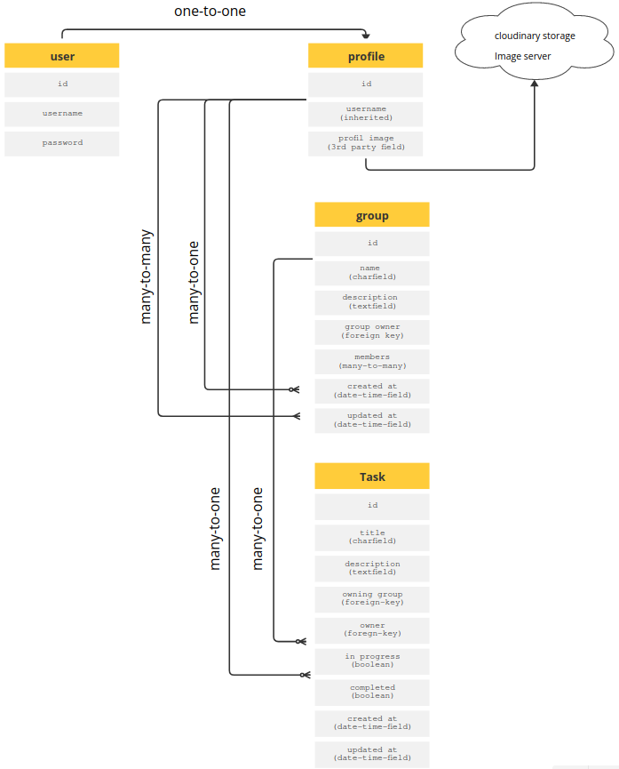
> Here is an overview of the PostGres relationship they have with eachother you can for example see:
> - `Profiles app`: Profiles has a one-to-one relation to the standard Django User model. 
> - `Groups app`: The group model has a many-to-many relation from the members field to the profiles model and a one-to-many relation with the group owners field to the profiles model. 
> - `Tasks app`: The tasks app is responsible for holding all data related to a task have a many to one relation to the profile - and the group model.

**Profiles app**:

- Profiles has a one to one relation to the standard django User model. The profile model does not add any extra functionality to the standard user model for this itteration of the application, except for the capability to add a profile picture, which becomes an important part of the front end part of the GroupTask app in order to identify different users and what groups they belong to. In the future, the profile model can easily extended to let users add their real names and maybe a descripion about themselves if a profile section would be beneficial to the app. 


**Groups app**: 
- The group model has a members field with a many-to-many relation to the profiles model enabeling many users to be part of many different groups at the same time. it also has a many to one relation with the group owner, since a user can own many different groups, but a group can only have one owner, the creator of the group. A group contains multiple tasks, so there is a one-to-many relation to the task model, so that we can see all tasks related to a specific group. The group owner is what replaces the need for different roles on this application. Only the group owner can decide what members are added and removed to a group - and if the group with all its members and tasks should be removed completely.


**Tasks app**:
- The tasks app is responsible for holding all data related to a task that is created, read, updated and deleted by a user within a group. apart from a title and description the task object also holds some bolean values that keep track of the lifecycle status of a task. The task lifecycle is Unititated, inProgress and Completed. 
By default a task that is created is beloning to the group that it is created within, it is modeled with an "owning_group field". But it also has an owner. that is the profile that changes the lifecycle status of the task from "unititated"  to "in progress and "completed".


## Views and Serializers

Each app contains several views that all are kept at simple as possible by extending the built in classbased views for Django Rest Framework to create the general CRUD functuinality and functionality to . Custom logic for each view are created in the Serializers within each app. 


**Profiles app**

The profile models serializer is also shared with the SimpleJWT 3rd party app in order to create a custom token that shares some information about the requesting users profile if the token request is successful. this is used to compare a loged in user with tasks and groups that exists in the database to determine priviligies in the front end application.

> **ProfileListView**
>
> the profile list view is an unprotected route to show a list of user currently signed up to the application.
>
> **ProfileDetailView**
>
> this view is not currently used in the front end, but shows one specific user. could be used to build out user build profile page in a later itteration.
>
> > To get the token to contain some additional information from the profiles app, a custom token creation class was added as well as a specific serializer and view that was imported to the urls.py file to replace the standard simpleJWT token view.
>> a step by step guide on how to do this can be found in simpleJWTs official documentation.

---

**groups app**

The main function to the groups app is to make sure that the user only sees groups that are relevant for the user itself. If a profile belongs to a group (is in the group's members list), it should be visible to the user.

There are several views that to the groups app here they are described: 

>**GroupListView:**
>
> The groupListView is responsible to show relevant groups to an authenticated user. Not all groups in the application is shown to the user, there is a standard "filtration" created by an authentication class that checks if a profile is a group member of the group, so that the groups list view only shows groups that a logged in user is a member of. 
> 
> **GroupMembersView:**
> 
> This view has the capability to both show members and modify > them. In the front end part of the app it is currently only used to modify members with a put request. This is because the group model itself has the members list attatched to it, so members can be viewed from the other views as well (GroupListVIew and GroupDetailView). 
> 
> The serializer for this view is built in such a way that there is only one request necessarry for both adding a deleting a user from the group's members list. The request sent to this view through the serializer accepts a profile id. The logic then checks if the profile id sent is already in the group's members list. If it is, the member is removed from the groups members list, if it is not, the profile with the correlating id is added to the group's members list. This makes it very easy to add and remove members from a group with the exact same type of request.

> **GroupDetaiView.**
> 
> The group detail view acts as the homepage for tasks. it's main responsiblity is to show a user what tasks are related to a specific group. As an added benefit, a user can also see what members belong to the group from this view. This view is also used to update a specific group if the name or description needs changing, as well as deleting a group completely from the database.


---

**tasks app**

when the task is first created it has the in_progress and completed fields are false, and the owner is set to null.

>The logic in the serializer extends the serializer update method and adds the following logic:
> - If the in_progress status is changed with a patch request from false to true, the owner is set to to the profile that is making the request. the completed status remains false. 
> This change is used by the front end to visually update the task card, and visually adds the task owners profile image to it, indicating who is currently working on the specific task. 
>
> - If in_progress is true and a patch request is sent that updates the completed status to true, the in_progress status is set to false and the user is set to null. 
>
> - A task can also be "reponend" by resetting both in_progress and completed to false after it has been completed. 
>
>> (in the my previous django project, milestone 4, I also had a status indicator that was created with a multiple choice field. after having done it both ways now, I know that multiple choice fields is a better approach than what I did here with multiple boolean fields.) But hey, at least it works...

> _Several views are created in this app:_
>
> **TaskListView:**
> 
> this list all tasks that belongs to a group that the requesting user is a member of. This is done through a custom authentication class that filters out all unrelated tasks from the database by default.
> Additionally, the task list view has an extensive set of filters attached to it. Both dynamic search filters based on title, descriptions, username and user id etc. that shows all tasks that *contains* any letters related to those in its query, as well as fixed query filters that needs an exact match. 
>
>> In the font end app, there are 3 nested routes one for unititated tasks, one for tasks that are in progress, and one for completed tasks. these routes all display tasks using this taskListView but they filter the results differently. 
> 
> **TaskDetailVIew:**
> 
> This view is used to update and delete a specific task. same as with the groupDetailView.
>
>
> **Event view:**
> 
>An early idea I had for this app was to create a page in the front end that displayed recent events related to the user, this view is acutally identical to the TaskListView, so in retrospect it is a bit unneccesarry but I thought that if this feature were to be implemented, it could be wise to have a different view for it if I wanted ot add functionalty to this view specifically. 
>> Due to lack of time this never made it to the first itteration of the front end application.

---

## Authentication Method

The project initially faced issues with the authentication system provided by dj-rest-auth. The solution was to install SimpleJWT directly, change the authentication class, and still use the dj-rest-auth views on top of it.

The initial issue I had was related to the backend. I could not get dj-rest-auth to work properly with the latest version of django. The second Issue I had was that when I finally got everything to work in the backend by rolling back to an earlier version of django, there were no way for me to find errors related to the refresh token view in dj-rest-auth. Since the refresh cycle is set to 15 minuts fixed, I could only see a certain errors I had when building the front end part of this app every 15 minuts, making it almost impossible to debug. 

> _Here is how I combined SimpleJWT and dj-rest-auth and replace the cookie based authentication with SimpleJWTs token based auth:_
> 
> Since dj-rest-auth is using simpleJWT in the background and then converting the token into a cookie based authentication I decided to rebuild the authetication system to something I could understand. Here is how I did it:
>
> -**I installed SimpleJWT directly:**
>   this allowed me to get all  the simple JWT settings inside settings.py which meant I could set the access token lifetime and the need to refresh it manually. I set it to 2 seconds to iron out all the problems I had in the front end. 
>
> - **Changed authentication class:**
> 
>    instead of using dj-rest-auth cookie authneticaiton class in settings.py I used the simpleJWT token authetication class.
> 
> - **I installed dj-rest-auth on top:**
> 
>    since simpleJWT uses the token to authenticate its views, I found out that I can still use the dj-rest-auth views, even if I did not use the cookie based authentication class they recommend.
> That means I can use the registration view for signing a user up, and the change and resett password views also works out of the box!
> 
> **change login and refresh token method:**
>
>   Instead requesting a refresh cookie, and checking the user status, and reroute user from left to right in the front end, I use simpleJWTs method of requesting a token from api/token/ view when a user logs in, I then store the access token in localStorage to use in the headers on every request. To make this more safe I have added token rotation and blacklisting in settings.py so that tokens can not be used twice. When a token becomes invalid a request to simpleJWTs refresh token view is made directly instead of through the hidden dj-rest-auth 3rd party view. 
>
>> This is probably not the most conventional way of doing this but it was the way I found to solve my problem and a way to learn and understand how token based authetication really works, it also happen to work great.

## Testing

Automated testing has been implemented in a file named `global_testing.py` in the root folder of this application. However, due to time constraints, automated tests are limited to authentications and the groups app, automated tests are not provided for the tasks app at this time.

### Manual testing:
To test the views further than the automated tests written, I have used Postman to send requests to the database. This allowed me to test the tokenbased views manually too.

_All tests below has been done with postman towards a locally runned version of the app with a mock sqlite database._

> **create a user in the database**
>
> 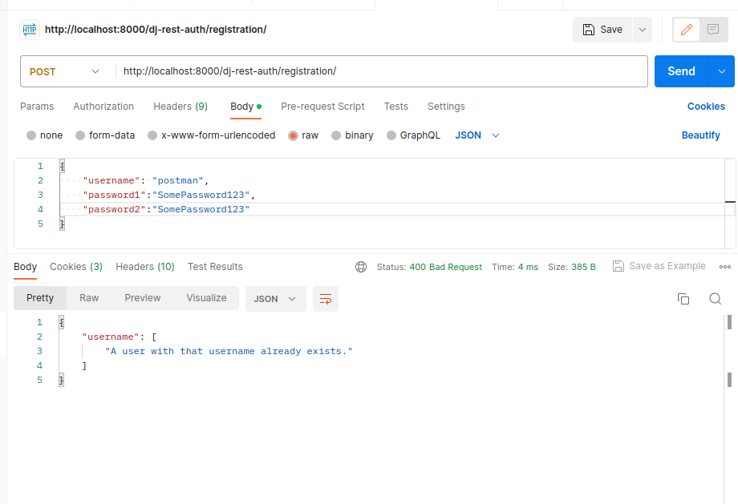
> here we can see that the registration view for dj-rest-auth responds correctly when I try to add a user that is currently already in the database. the dj-rest-auth registration view, therefor works as expected.


> **Log in /token view**
>
> 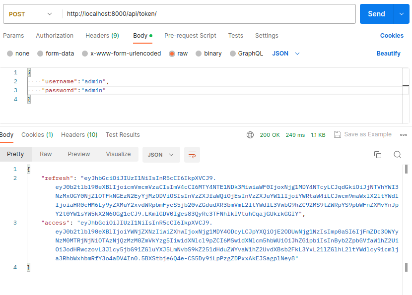
> when I send a payload with an existing user to the modified SimpleJWT view, we get a correct response with an object containing both the access token needed for the protected views, as well as the refresh token. 
>
> 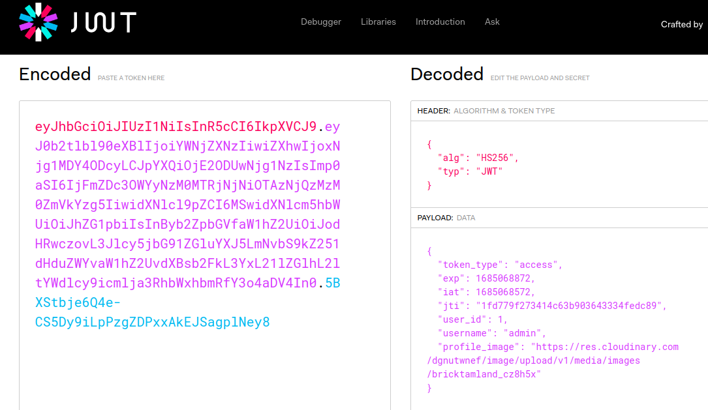
> Here we can see the decoded version of the access token, you can for example see that the profile image is baked into the token for easy access in the front end application.


> **refreshing the token**
>
> 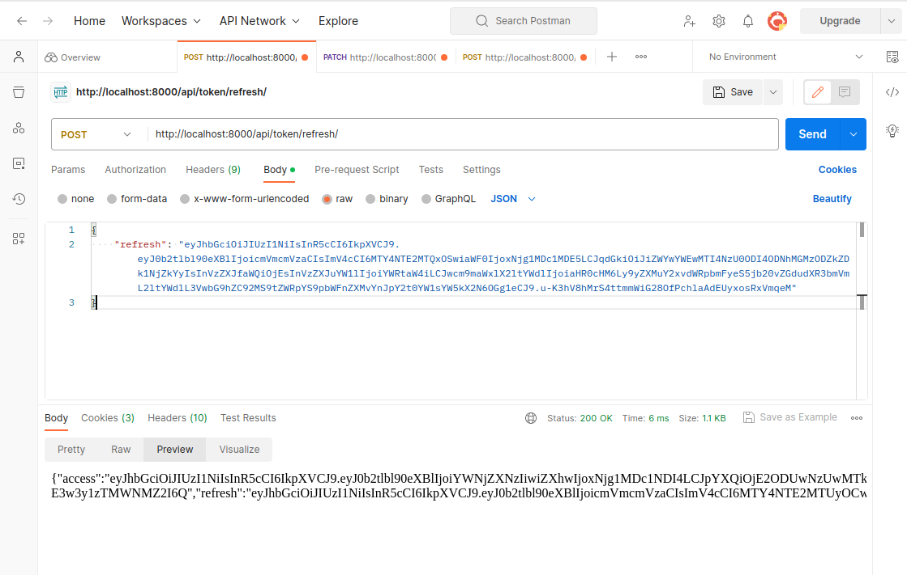
> to retreive a new accesstoken, the refresh token endpoint is used. as you can see here, it works as expected returning a status of 200 and an object containing new refreshed tokens. 


> **list all groups related to the user**
>
> 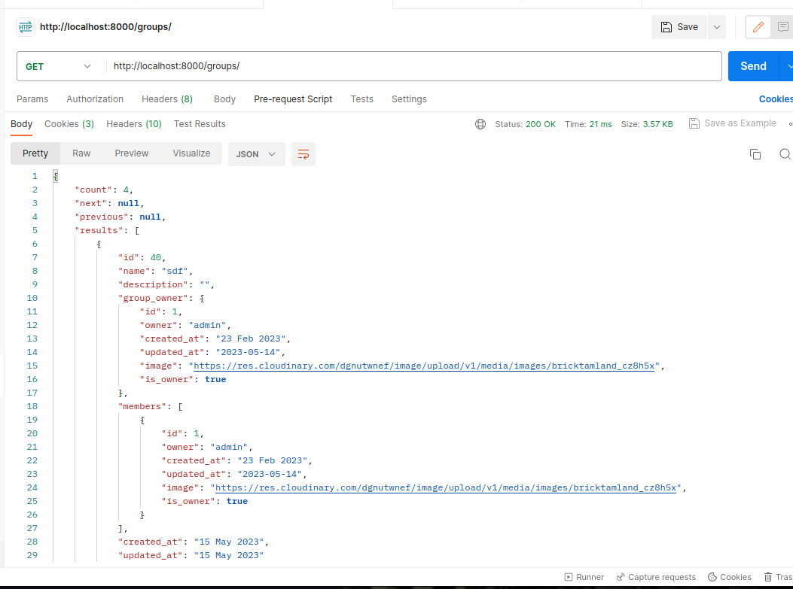
> with the access token in the headers, I am able to list all groups related to the loged in user. The user can not only see the groups that he/she created, but all the groups that the user is a member of, thanks to the custom filter backend.

> **view specific group**
>
> 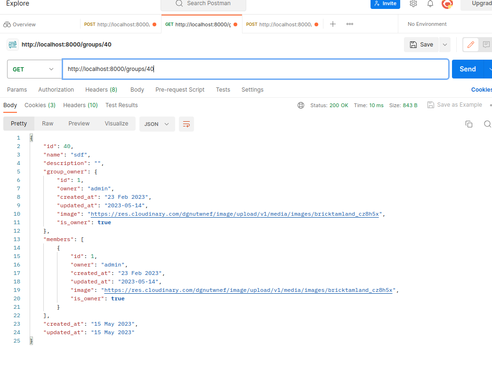
> thanks to the group detail view, a user can view the details of a group. This view supports GET PUT PATCH and POST and is responsible for the crud functionality in the group. this is further tested in the front end documentation.

> **view all tasks related to a user**
>
> 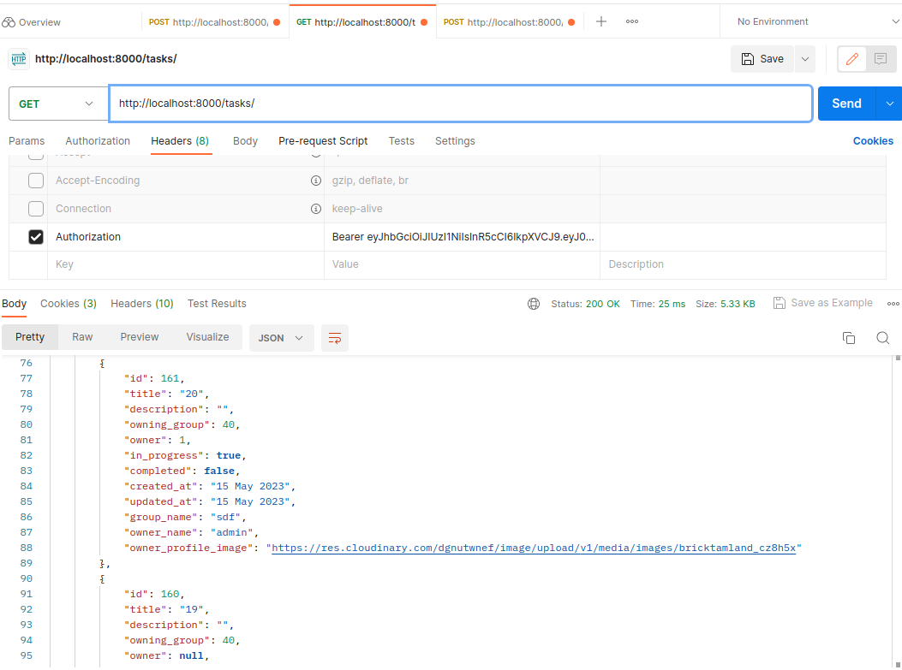
> much like the groups list view, this view shows all tasks that belongs to groups that the user is a member of thanks to the custom filter backend class located in the projects folder of this app.

> **view specific task**
>
> 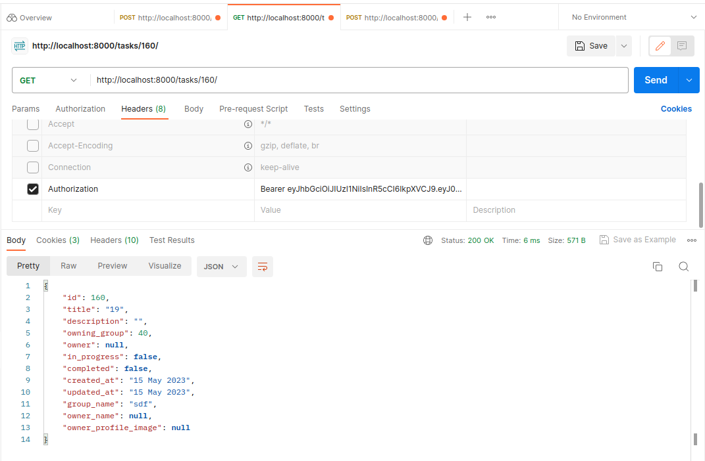
> a user can view a specific task and has full CRUD functionalty of it as long as she is the owner of it, OR the task has no owner, owner = null. this is further tested in the front end side of the application.

> **create a new task**
>
> 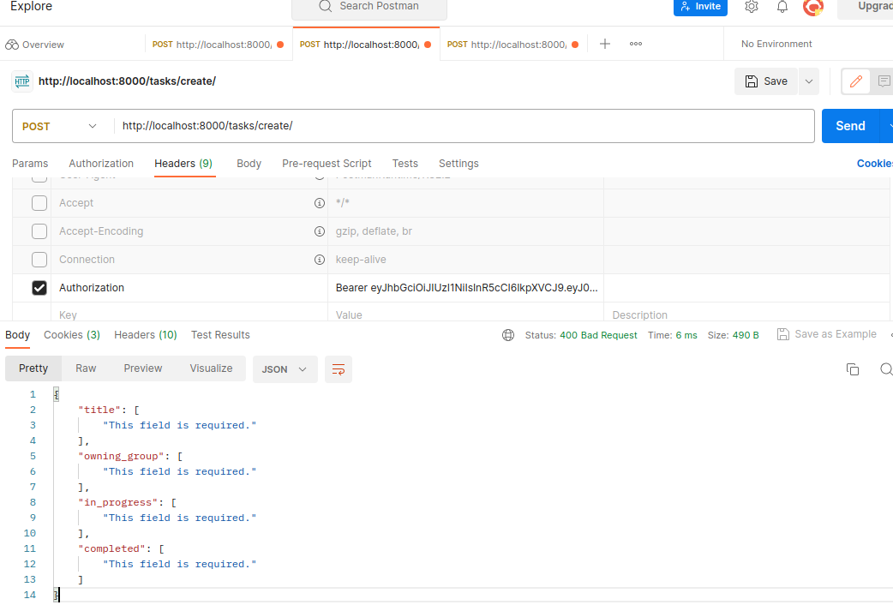
> Here I have tested if I get a bad request if I do not fill in the mandetory fields. Works as expected. this tells me that this view works correctly, and is also tested in in the front-end application.


> **Take ownership of a task**
>
> 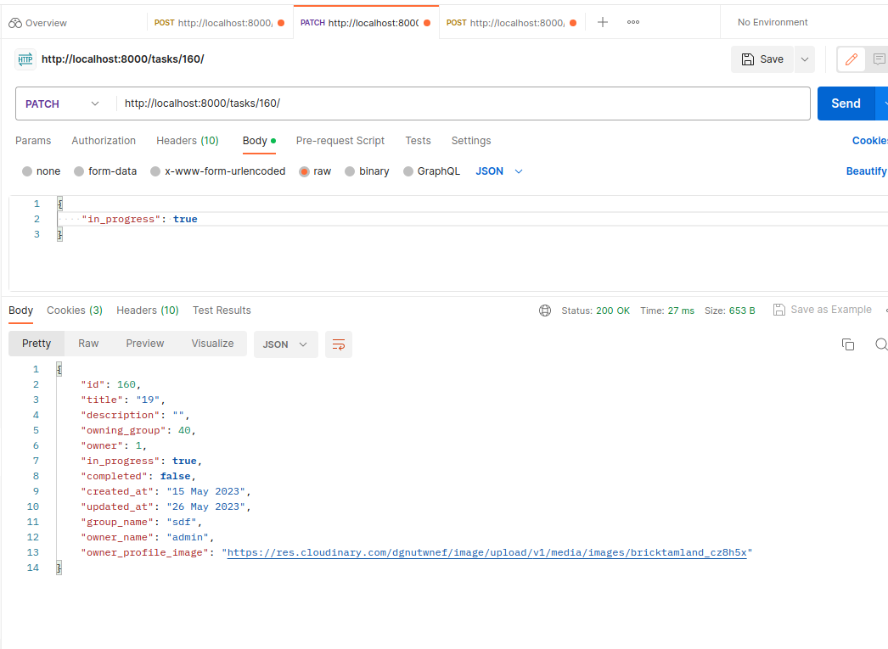
> here we can see that the logic described under the "views and serializers" part of this documentation for the tasks seems to work as expected. I can send a PATCH requests only setting the "in progress to TRUE, and it automatically updates the owner from "null" to the requesting user. which is what we want. an extra serializer field is also added to more easily access the profile image and owners username...


> **Deligation is not allowed on this app**
>
> 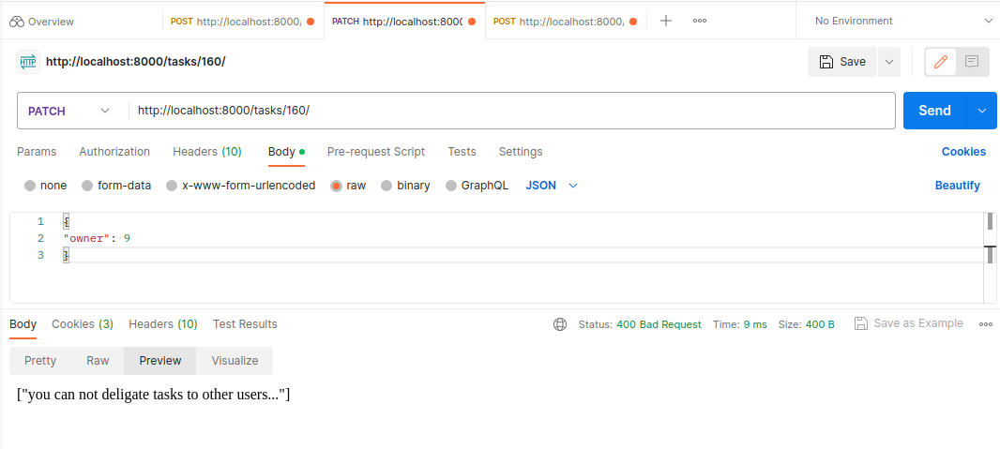
> Here we can see a custom error message appearing if a user to add another user as owner of the task. You can only take ownership of a task yourself, and it should be done by manipulating the in_progress key, not setting the owner manually.

> **Take ownership of a task**
>
> 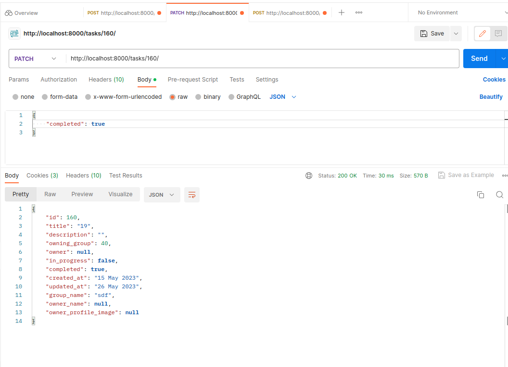
> If a user wants to complete a task, by setting the completed to TRUE, the serializers update logic takes care of the rest by setting in_progress to false, and user to null automatically.


> **Take ownership of a task**
>
> 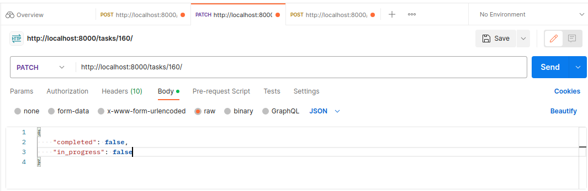
> If a user wants to re-open a task that is completed on a server, a task that was either completed by yourself or someone else in the group, since the onwer is set to null when a task is completed, any user within a group can re-open a task by simply patching it with the payload seen here. setting both completed and in progress to false.


> **adding and removing a member from a group**
>
> 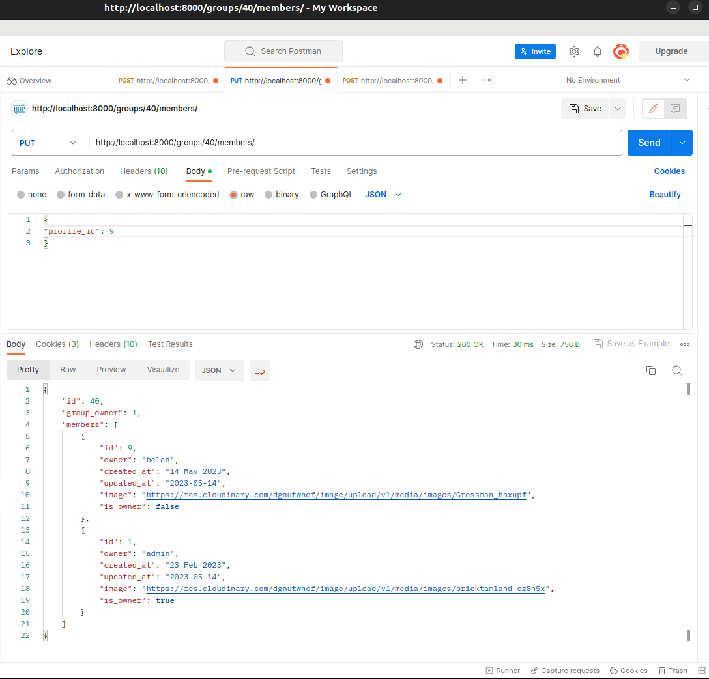
> thanks to the custom logic in the serializer connected to the group app's members view, it is very easy to add and remove a member. A PUT request with a profile id. if the profile id already matches a profile id in the members list, it will be removed, else the profile will be added to the members list as we can see here.

> **adding and removing a member from a group**
>
> 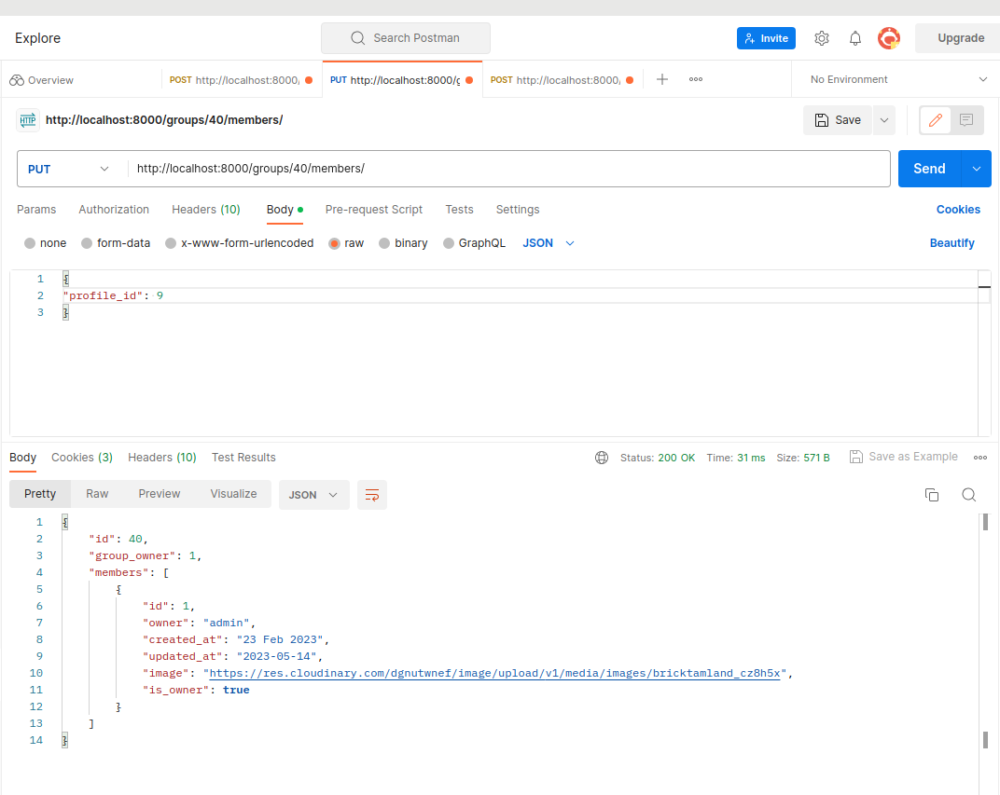
> As you can see, the same request is sent, but now the member was already in the members array, so it is removed in this case.


> **members view is only for group owners**
>
> 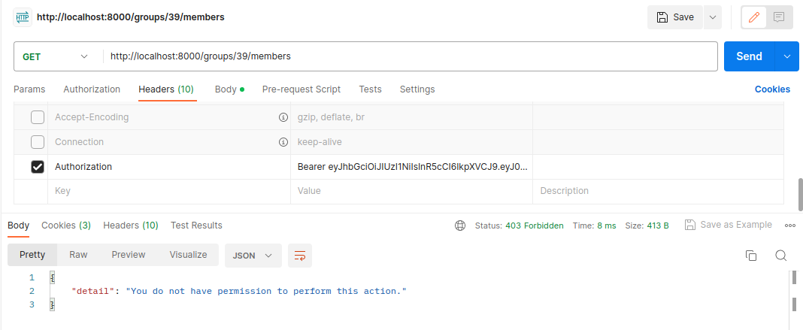
> If you are not the owner of the group you are not allowed to modify the members list in this app, so a user that does not own a group can not access this specific members view. instead, the group members is displayed in the group detail view for every member, since the members list is a field in the group model it is viewable from there instead.


This concludes the testing for the backend, tests on the front end confirms that the crud functionality is working as expected. 

The dj-rest-auth views works along side the simpeJWT views, even though we are not using the dj-rest-auth cookie authentication class in the settings.py file. I have also tried out the reset password, and change password views from dj-rest-auth. they work but are not used in this itteration of the application, so I did not include that in the documentation. 


## installation

Before running this project: 

- make sure you you have an environment with **python3.10.6** or later installed. 
- sign up to cloudinary and make sure you have access to your cloudinary URL.
- have access to a postgres database (I used elephantsql for this project which is a free shared sql server option)

there are also a few neccesary environment variables to include before running the project. On step 3 in "getting started" copy the following code into your env.py file and change the placeholder text to your personal information.

``` python
# copy this entire block of code
# into a file named env.py
import os

import os

#secret key
os.environ['SECRET_KEY'] = "<your secret key>"

# URL to cloudinary image cdn for profile pic
os.environ['CLOUDINARY_URL'] = "cloudinary:// <your cloudinary storage url>"

# if dev is true, DEBUG is true and session based authentication is used-
os.environ['DEV'] = '1'

#if PROD is true, this project uses your DATABASE_URL as database
# else it uses the built in django sqlite test server.
os.environ['PROD'] = '1'

#database url to your postgres server, if you want to publish a similar project
os.environ['DATABASE_URL'] = 'postgres:// <your postgress url> '

```

These instructions will get you a copy of the project up and running on your local machine for development and testing purposes. See deployment for notes on how to deploy the project on a live system.

> **1. clone repository and cd**
> - open  terminal
> - change current work-directory to where you want the cloned directory
> - type git clone then the url to this project
> > $ ``` git clone https://github.com/4ntm4n/ms-five-api```
> - then change directory into the project folder:
> > $ ```cd ms-five-api```

> **2. Start environment and install dependencies**
> - Create a development environment with python 3.10.6. example with virtualenv and python 3.10.6 as default:
> > $ ```virtualenv rest_env```
> 
> > $ ```source rest_env/bin/activate```
>  - then, in your development environment run:
> >$ ``` pip install -r requirements.txt```

> **3.  set up environment variables**
> - create env.py file and set up mandetory environent variables shown below
> > $```nano env.py``` 
> - then paste in the code from **_Prerequisites_** above.
> - exit by pressing **'ctrl** + **x'** and **'y'** to save **_env.py_** and hit **enter** to exit nano.

> **4. Remove FRONT_END_PROD from settings.py**
> - locate ```CORS_ALLOWED_ORIGINS``` and remove ```os.environ.get('FRONT_END_PROD')``` with ``` "http://127.0.0.1", "http://localhost:3000" ```.
> t

> **5. Make Migrations and Migrate**
>  - run the following code to make migrations (should not be needed, but good practice before migration):
> > $ ```python3 manage.py makemigrations```
> - then migrate. 
> > $ ```python3 manage.py migrate```

> **6. run the dev server and you are done!**
> - in the terminal, type:
> > $ ```python3 manage.py runserver```
> -  go to **_http://localhost:8000/_** to run the project locally.
> > Note that the server will be hosted on **_localhost_**  and that the specific adress: **_127.0.0.1_** is not an allowed host by default in this project. 
> >
> >It can, however, be added to the **ALLOWED_HOSTS** list in **settings.py** if you want to.

### Deployment
Follow these steps to deploy this project to heroku.

> 1. create a heroku project
> 
> 2. create a postgresql database
>
> 3. in heroku config vars add the following information: 
> > ```ALLOWED_HOSTS | <url to heroku project>```
> 
> > ```PROD | True```
>  
> > ```CLOUDINARY_URL| <your cloudinary url>```
>   
> > ```DATABASE_URL | <your database url>```
>
> > ```DISABLE_COLLECTSTATIC | 1```
>
> > ```SECRET_KEY | <your django secret key>```
>

> > if you want to connect a front end to this rest-app. add:
> > ```FRONT_END_PROD | <link to front end project>```
> > in settings.py locate ```CORS_ALLOWED_ORIGINS``` and add ```os.environ.get('FRONT_END_PROD')``` to the list or set hardcode the url to your front end directly in the cors_allowed_origins list.
> 
> 4. push repository directly to heroku or enable deployment through github and deploy branch.

---

## resourses I have used

SimpleJWT documentation:
https://django-rest-framework-simplejwt.readthedocs.io/en/latest/

dj-rest-auth documentation:
https://dj-rest-auth.readthedocs.io/en/latest/

Rest Framework built in permission classes: 
https://www.django-rest-framework.org/api-guide/exceptions/

Many useful tips on classbased views:
https://www.youtube.com/@veryacademy

general knowledge:
Codeinstitute.net
codecademy.com

By Anton Askling student @ Code Institute.
Probably the last project to ever be created without the help of chatgpt. Thanks for reading.
